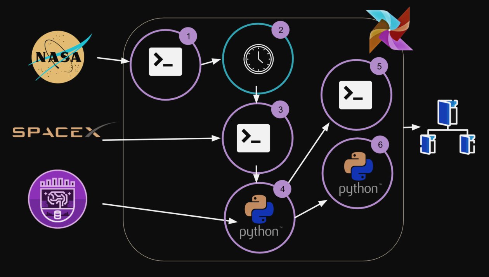
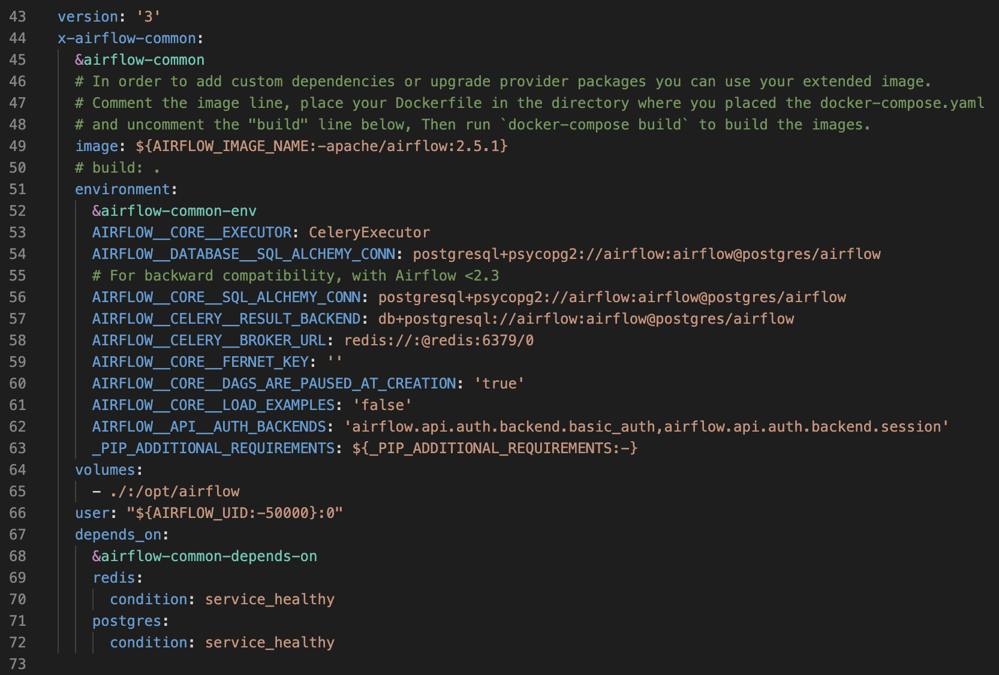

# Airflow Space Exploration 

Project of the Fundamentals of Apache Airflow course in Platzi, creation of a Data Pipeline that will come from one of the SpaceX satellites.

## Objetives

Platzi's analyst and marketing teams need data from the students who have accessed the satellite and history information Spacex events, therefore we need help to execute the following tasks:

1. Wait for NASA to give us authorization to access the data
of the satellite.
2. Collect data from the satellite and leave it in a file.
3. Collect data from the SpaceX API and put it in a file.
4. Send a message to the teams that the final data is
available.

### Workflow

### Graph

## Requirements

* Docker
* Python >= 3

## Enable Modification of the airflor.cfg 

Enter the docker-compose file and within the next section **volumes**, add the following line:

    - ./:/opt/airflow

With this, when raising our container, the configuration files will be moved to the path where our project is the most important being **airflow.cfg**.

## Setting Airflow Email Alerts Using Gmail

Edit **airflow.cfg** file to add the details for the mail server. Is obligatory create a Google App Password for your gmail account, follow the next steps:

1. Visit App Passwords page. (https://security.google.com/settings/security/apppasswords)
2. At the bottom, click **Select App** and choose the app you are using.
3. Click **Select Device** and choose the device you are using.
4. Select Generate.
5. Follow the instructions to enter the **App Password** (the 16 character code) on your device.
6. Select Done.

In airflow.cfg edit the [smtp] section as shown below:

your_email_address = Your Gmail address.

16_digit_app_password = The App Password gnerated above.

Although I take a .env approach to protect my login credentials from being pushed to the repository (define .env in .gitignore)

## Execute the Project
    $ docker-compose up

Enter in the website: https://localhost:8080

## Result to project
### Sent notification:

### Received notification:
